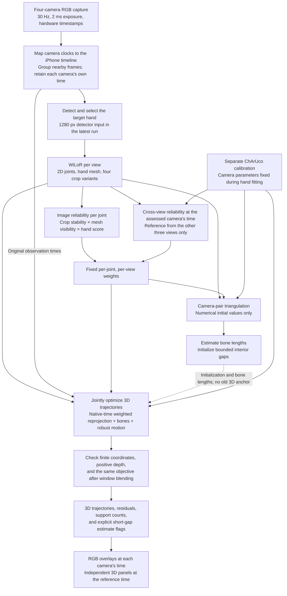

# Hand Detection, Reliability Weighting, and Camera-Time 3D Trajectories

This document describes the trajectory reconstruction used for the latest hand-booth processing run on **2026-10-08**. It explains why the pipeline changed, how observations constrain a moving hand, and what its outputs mean.

**Terminology:** “block detection” means hand bounding-box detection. “Weighted calibration” means weighted pose fitting with an already calibrated camera rig. The hand fit updates joint trajectories; camera intrinsics, distortion, extrinsics, and clock mappings remain fixed. ChArUco camera calibration is a separate operation.

## 1. Motivation and current configuration

| Observed problem | Implemented response | What it addresses |
| --- | --- | --- |
| Genuine fast movements were pulled toward an overly smooth pose | Weaker acceleration penalty with a robust soft-L1 loss | Allows larger accelerations without letting them dominate the fit |
| An incorrect initial 3D pose constrained later corrections | Optimize weighted 2D reprojection, bones, and motion together; use triangulation only for numerical initialization | Removes the old reconstructed skeleton as a 3D target |
| Individually plausible 2D predictions disagreed during motion | Evaluate a 3D trajectory at each camera's recorded observation time | Accounts for recorded capture-time differences between views |
| Brief missed detections made joints disappear | Fit bounded interior gaps and label the recovered positions | Reduces short interruptions without extrapolating long missing segments |
| cam03 frequently classified the target right hand as left | Configurable detector input size; the latest run uses 1280 px | Preserves more image detail before handedness filtering |
| Blur and camera-model mismatch degraded otherwise usable observations | 30 Hz capture, fixed 2 ms exposure, and fresh ChArUco extrinsics | Improves the inputs supplied to reconstruction |

The installed collection configuration and the example configuration use **30 Hz and 2000 microseconds exposure**. The recent capture readbacks were approximately 29.995 Hz and 2001 microseconds. The installed rig uses the calibration recorded on 2026-10-08 at 21:06:04, America/Chicago. Local configuration and calibration data are not committed to this repository.

**Processing mode is an explicit choice.** The latest offline run uses `--fit-mode trajectory` and `detectorImageSize: 1280`. Automatic post-capture processing and the weighted CLI still default to `legacy`; this documentation does not imply that those defaults have changed. Existing recordings retain their own configuration snapshots.

## 2. Conceptual flow



Triangulation remains a useful way to start the numerical solver. The final pose is determined by a joint objective, rather than by correcting a fixed old skeleton.

## 3. Capture, timing, and separate camera calibration

The camera worker disables automatic exposure, selects Timed exposure mode, checks the requested exposure against the camera range, and verifies both setting readback and per-frame exposure metadata. Gain is unchanged. Short exposure reduces motion blur but requires enough illumination; it does not resolve occlusion or handedness mistakes.

Camera hardware timestamps are mapped to PC time and then to the iPhone timeline. Nearby unused frames are associated within the configured skew limit, while their individual timestamps remain available in `frame_sets.jsonl`. The first camera supplies the common reference time. These are free-running cameras, not hardware-synchronized exposures.

Camera calibration uses the physically confirmed ChArUco board: 10 × 8 squares, 22 mm square size, 16 mm markers, and `DICT_4X4_50`. The latest deployed solve kept intrinsics fixed and updated rigid camera extrinsics using observations limited by estimated board motion. It passed cross-view validation on held-out time blocks from the same recording. Those blocks are not a separate independent validation capture.

A correct hand fit cannot compensate for a camera that has moved relative to its calibration. New parameters apply to older recordings only if the rig and lens settings were unchanged.

## 4. Detection and per-joint reliability

### Target selection and detector resolution

The baseline WiLoR pass provides saved 2D predictions for target association. During reliability inference, a reference from the other three paired views guides box selection when those views agree. Otherwise, selection uses the baseline prediction, then the largest candidate of the configured hand side. This initial identity guide uses paired frames; the subsequent trajectory geometry weights use time-aligned observations as described below. There is no persistent identity tracker.

The installed detector checkpoint defaults to a 512 px input. Add this optional field to the session's `multicamera/config.json` before starting a fresh reliability cache to reproduce the latest run:

```json
{
  "detectorImageSize": 1280
}
```

This is a configuration fragment, not a replacement for the complete file. It controls the detector input size; saved boxes and joint coordinates remain in original-image pixels. The override is recorded in the inference report and cache manifest. Higher resolution can improve detection and handedness classification, but target selection remains heuristic.

WiLoR predicts 21 joints and a hand mesh from the selected crop, including predictions for hidden fingers. The baseline's binary in-box flag is not a learned keypoint confidence score.

### Image reliability

Each camera receives a separate weight for each joint. The reliability pass runs WiLoR on the original crop and three slightly perturbed crops.

For RMS joint displacement `d` across the crop variants and original-image hand extent `h`:

```text
s = max(3 px, 0.025 × h)
w_stability = 1 / (1 + (d / s)^2)
```

For mesh self-visibility, the implementation selects 16 fixed anatomical skin vertices around each joint on the rest mesh and follows them into the predicted pose. From WiLoR's virtual camera, it ray-tests those samples against the mesh. A sample counts as visible when it lies no more than 1 mm behind the nearest mesh surface on its ray.

```text
v = visible skin samples / 16
w_mesh = 0.35 + 0.65 × clip(v / 0.45, 0, 1)
w_image = w_stability × w_mesh × clip(hand_detector_score, 0.3, 1)
```

Nonfinite or out-of-image joints receive zero image weight. Mesh visibility is a soft self-occlusion hint: it cannot see an external occluder and can inherit errors in the predicted mesh. Stable predictions can also be consistently wrong. These weights are not calibrated probabilities.

### Cross-view reliability at camera time

To assess camera `c` at time `t_c`, interpolate the other views' 2D predictions to that time only where valid bracketing observations are at most 120 ms apart. Build a geometric reference using only the other three cameras. A candidate reference must have positive depth and agree with all three within 12 px.

If a trustworthy reference exists, compare its projection with camera `c`'s prediction. For disagreement `e` in pixels:

```text
w_geometry = max(0.02, 1 / (1 + (e / 15)^2))
w_final = w_image × w_geometry
```

If the other views cannot establish a reference, the geometric factor stays at 1. Lack of corroboration alone does not establish that the assessed view is wrong. Weights are then fixed for the final fit; the solver does not repeatedly lower a view's weight simply because its current trajectory disagrees with it.

## 5. Joint optimization of a moving 3D hand

### Initialization

Camera-pair triangulation supplies numerical seeds. Candidate pairs require weights of at least 0.15 in both views, positive depth, at least a 2-degree ray intersection angle, and at most 15 px reprojection error in each generating view. Candidates are ranked by weighted robust error across all available views.

Time-aligned 2D predictions are preferred for seed construction. Where that cannot produce a seed, a valid pair of native observations may initialize one, marked `nativeSeedFallback`. This fallback is a guess, not an observation of a simultaneous 3D pose. Bone lengths are estimated robustly from supported seeds, preferring three-view support. Insufficient support causes an explicit error.

No baseline 3D pose, old missing-joint mask, or pre-smoothed skeleton is read by the trajectory fit.

### Native-time observations

The variables are 3D joint positions at common reference timestamps. Between adjacent valid knots, positions are piecewise linear:

```text
X_j(t_c) = (1 - alpha) × X_j(t_left) + alpha × X_j(t_right)
alpha = (t_c - t_left) / (t_right - t_left)
```

An original 2D observation `u_cj` recorded at camera time `t_c` constrains `project_c(X_j(t_c))`. Both bracketing knots contribute to the optimization Jacobian. The fitting data are the original 2D predictions at original camera times. Interpolated 2D points are used only for initialization and geometric reliability.

### One objective

| Term | Residual scale | Loss |
| --- | --- | --- |
| Native-time 2D reprojection | 3 px | Per-joint weight × soft-L1 |
| Bone length deviation | `max(1.5 mm, 4% of estimated bone length)` | Quadratic |
| Timestamp-based acceleration | 10 m/s² | Soft-L1 |

Conceptually, with `rho(z) = 2 × (sqrt(1 + z) - 1)`:

```text
E(X) = sum(weight × rho(((project_c(X_j(t_c)) - u_cj) / 3 px)^2))
       + sum(bone_length_residual^2)
       + sum(rho((acceleration / 10 m/s²)^2))
```

Image terms are summed over cameras, observations, joints, and image coordinates. Reliability multiplies the robust image loss, rather than changing its transition scale. There is no old-3D anchor term. Camera parameters and clock mappings are fixed.

Motion uses actual time differences:

```text
v_before = (X[t]   - X[t-1]) / (time[t]   - time[t-1])
v_after  = (X[t+1] - X[t])   / (time[t+1] - time[t])
a        = 2 × (v_after - v_before) / (time[t+1] - time[t-1])
```

The weaker, robust motion penalty reduces pressure to smooth away genuine rapid movement. It still allows tradeoffs between image agreement, bone lengths, and continuity; it does not guarantee that every observation improves.

The fit uses 80-frame windows with 20-frame overlap and blends overlapping solutions. Motion constraints do not connect across time steps longer than 120 ms. At 30 Hz, an 80-frame window covers approximately 2.7 seconds.

## 6. Short gaps, acceptance checks, and uncertain joints

Missing interior seeds may enter the optimization only when valid seeds bracket the gap within 150 ms. The recovered positions are jointly constrained by available images, bone lengths, and neighboring motion. Long gaps and sequence endpoints remain missing; no extrapolation is performed.

Recovered positions are labelled `temporalInferred`. A temporary single-view observation can help constrain a trajectory supported by neighboring frames, but it does not independently measure depth.

Non-converged windows retain their initial coordinates. After blending, nonfinite or behind-camera knots are rejected individually and remain missing; projection does not bridge those rejected knots. The same full objective is compared before and after fitting on the same retained variables and observations. If the objective increases, the retained initialization is used instead. Rejected knots and objective acceptance are reported explicitly.

These are numerical consistency checks, not proof of anatomical or ground-truth accuracy. There is no explicit learned joint-angle or palm-shape prior.

For support reporting, a nearby camera observation counts when its weight is at least 0.15 and its trajectory reprojection error is at most 15 px. `camerasUsed` counts such observations; it does not prove simultaneous multiview support at a knot. The viewer also reports a separate all-view audit at 10 px. Those diagnostics use different thresholds and should not be conflated.

## 7. Outputs and visualization

The trajectory run writes `multicamera/weighted_handpose/`:

| File or field | Meaning |
| --- | --- |
| `observations.npz`, `inference_report.json`, `cache/manifest.json` | Predictions, reliability inputs, detector size override, and input provenance |
| `joint_initialization.npz` | Numerical initial coordinates and seed camera pairs |
| `optimization_candidate.npz` | Blended candidate before final acceptance checks |
| `pose_3d.npz`, `hand_pose_aligned.jsonl` | Final trajectories and per-joint diagnostics |
| `weighted_report.json` | Objective checks, window convergence, reprojection errors, support, and completeness |
| `temporalInferred`, `seedValid` | Estimated short-gap positions versus positions with numerical seeds |
| `perViewJoints`, `viewUnixTimeMs`, `perViewTemporalInferred` | Trajectory positions and estimate flags at each camera's recorded time |

The clean MP4 displays:

- **Orange:** selected WiLoR 2D predictions from the reliability pass.
- **Cyan:** the fitted trajectory projected at each RGB camera's own time.
- **Yellow rings:** short-gap trajectory estimates.
- **Weighted 3D joints panels:** the same trajectory at the common reference time, from two fixed viewing angles.

The interactive viewer also exposes weights and support diagnostics. IMU/EIT visualization, where prepared, shares the replay timeline but does not enter the 3D fitting objective.

Exports use the session's configured frame rate. Pose matching is limited to half an output-frame interval plus 1 ms. Export does not add another smoothing or gap-filling pass. More displayed joints means greater output completeness, not necessarily more independently measured joints or greater accuracy.

## 8. Run the latest mode and preserve provenance

Required inputs are the session's `multicamera/config.json`, `calibration.toml`, `frame_sets.jsonl`, raw RGB and timing files, and `handpose/wilor_2d.npz`. The baseline 2D file supplies identity guidance; an Anipose 3D output is not required for trajectory mode. Visualization also uses the session timestamp, capture, clock-sync, and IMU files.

From the repository root, with dependencies and local environment paths configured:

```bash
python scripts/run.py weighted data/dataset_multicamera/<sessionId> \
  --fit-mode trajectory --inference-workers 4

python scripts/run.py export-clean data/dataset_multicamera/<sessionId>
```

Use fewer inference workers when GPU memory is limited. Workers process disjoint 64-frame chunks without downsampling. Completed compatible chunks are reused, then assembled into the full observation sequence.

All fitting modes write the same `weighted_handpose` output directory. Preserve existing results in a separate session/review directory before rerunning a different mode. Input hashes and detector-size overrides prevent incompatible reliability-cache reuse. Changing calibration, frame pairing, baseline 2D guidance, or detector resolution requires a fresh compatible cache; updating a calibration file alone does not regenerate poses or videos.

## 9. Scope of validation and remaining limits

On session `3378553B-D57F-4D62-8A65-8AA2E4AA9DA9`, the latest run processed 1,738 paired frames with the new calibration and 1280 px detection. cam03 detection coverage increased from 68.0% to 97.4% on the same recording. High-weight reprojection error decreased from a 4.73 px median at trajectory initialization to 3.23 px after fitting. Output completeness was 98.8%, including labelled gap estimates. These metrics measure detection coverage, agreement with predictions, and completeness; they are not ground-truth 3D accuracy.

Recorded camera times still have clock-mapping uncertainty. Exposure-start/end/midpoint semantics have not been independently established, so the code does not guess an exposure/2 timestamp correction. Trajectory fitting cannot undo motion blur or unknown clock bias, and piecewise-linear motion can miss nonlinear movement between frames. Occlusion, wrong-hand association, incorrect 2D predictions, and calibration changes remain possible error sources.

## 10. Implementation map and compatibility

| Implementation | Responsibility |
| --- | --- |
| [multicamera_worker.py](pc_receiver/multicamera_worker.py) | Acquisition, exposure checks, and hardware timestamp metadata |
| [align_multicamera.py](pc_receiver/align_multicamera.py) | Clock mapping and frame association |
| [infer_hand_reliability.py](pc_receiver/infer_hand_reliability.py) | Detector resolution, target association, crop variants, mesh cache, and inference sharding |
| [hand_reliability.py](pc_receiver/hand_reliability.py) | Image reliability, mesh visibility, and geometric reference helpers |
| [fit_joint_handpose.py](pc_receiver/fit_joint_handpose.py) | Pair initialization, direct joint objective, mode dispatch, and output reports |
| [fit_hand_trajectory.py](pc_receiver/fit_hand_trajectory.py) | Camera-time trajectory evaluation, bounded gaps, optimization, and acceptance checks |
| [regularize_handpose.py](pc_receiver/regularize_handpose.py) | Shared bone estimation, motion residuals, and diagnostics |
| [process_weighted_handpose.py](pc_receiver/process_weighted_handpose.py) | Inference, fitting, visualization, and review orchestration |
| [solve_multicamera_calibration.py](pc_receiver/solve_multicamera_calibration.py) | Separate ChArUco camera calibration and validation |
| [visualize_multicamera.py](pc_receiver/visualize_multicamera.py) | Per-camera projections, audit, and interactive replay |
| [export_pose_presentation.py](pc_receiver/export_pose_presentation.py) | Clean RGB and independent 3D-panel MP4 export |

The retained `legacy` mode refines an existing Anipose/regularized 3D skeleton and has separate anchor and rollback behavior. The `joint` mode removes that old 3D anchor but evaluates observations at a common nominal frame time. The `trajectory` mode described above additionally uses each camera's recorded time and bounded gap recovery. Mode-specific reports and the session configuration are the source of truth for a run.
