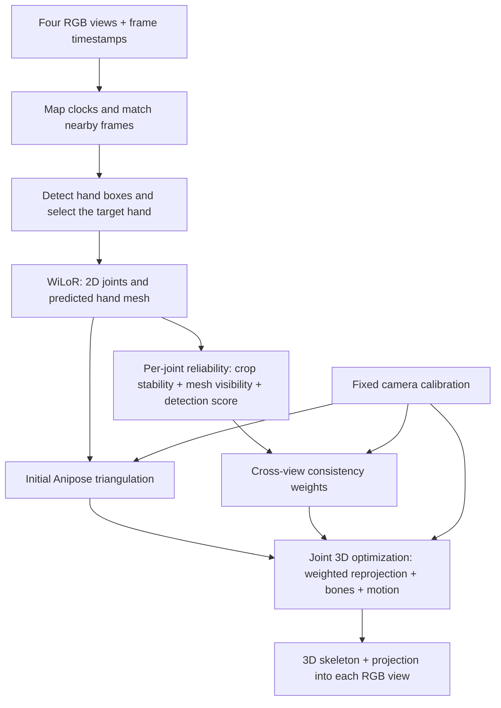

# Detection, Reliability Weighting, and 3D Consistency

This document explains the implemented WiLoR + Anipose reconstruction pipeline and why an occluded joint should contribute less than a clearly observed joint.

## 1. Terminology and flow

**Block detection** means **hand bounding-box detection**: locating the image region containing a hand before running WiLoR.

**Weighted calibration** is more precisely **weighted, calibrated 3D pose fitting** in this pipeline. The fit updates joint positions using a fixed camera model. It does not refine camera intrinsics, distortion, or extrinsics. Camera calibration is a separate ChArUco procedure.



## 2. Frame matching and hand detection

Camera hardware timestamps are mapped through the PC clock to the iPhone timeline. The first camera supplies the reference timestamp. Matching uses nearby unused frames, checks the total time span across views, and tries alternative bracketing combinations if individually nearest frames exceed the configured limit.

This is timestamp-based association, not hardware exposure synchronization. A rapidly moving finger may occupy different positions during the four exposures.

For each view, the detector produces hand boxes and a whole-hand score. The baseline selects the largest hand of the configured side. During the reliability pass, selection uses a reference from the other three views when they agree; otherwise it falls back to the baseline selection, then the largest candidate. This association is a heuristic and can still select a bystander's hand.

WiLoR predicts a hand mesh and 21 joints from the selected crop. Its projected 2D joints can exist even when a finger is hidden: they are model predictions, not proof that the joint was seen. The baseline's binary keypoint-validity channel is not a learned per-joint confidence score.

## 3. Per-joint reliability

Each camera contributes a separate weight for each joint and time step. A single hand detection score is insufficient because one finger can be hidden while the rest of the hand is visible.

### Crop stability

WiLoR is run on the original crop and three slightly shifted/scaled crops. Let `d` be the joint's RMS displacement in original-image pixels relative to the original-crop prediction, and `s = max(3 px, 0.025 × hand extent)`.

```text
w_stability = 1 / (1 + (d / s)^2)
```

A prediction that moves substantially when the crop changes receives less weight. A stable prediction can still be consistently wrong.

### Mesh self-visibility

The implementation selects a fixed patch of 16 mesh vertices near each joint on the rest-pose hand mesh. It follows those same anatomical vertices in the predicted posed mesh.

From WiLoR's predicted virtual camera, it compares each sample's depth with the nearest intersecting mesh surface along the same ray. A sample is considered visible if it is no more than 1 mm behind that surface. The visible fraction is the number of visible samples divided by 16.

```text
v = visible skin samples / 16
w_mesh = 0.35 + 0.65 × clip(v / 0.45, 0, 1)
```

The test uses skin samples rather than internal skeletal joint centers. It estimates **self-occlusion in the predicted mesh**; it cannot detect an external object covering the hand and can inherit WiLoR's shape or pose mistakes. The 0.35 floor makes it a soft penalty rather than a visibility veto. An unavailable visibility estimate is treated neutrally.

### Whole-hand detection score

The selected hand's detector score is clipped to `[0.3, 1]` and multiplied into the joint weight. Nonfinite or out-of-image 2D joints receive zero image weight.

```text
w_image = w_stability × w_mesh × clipped_hand_detection_score
```

These values are heuristic reliability weights, not calibrated probabilities of correctness or visibility.

## 4. Cross-view consistency

To assess one view, the pipeline constructs a reference using **only the other three views**. It considers pairwise triangulations among those views and requires the resulting point to agree with all three within 12 px. Positive-depth checks also apply.

If that independent reference exists, its projection is compared with the assessed view's 2D prediction. For disagreement `e` in pixels:

```text
w_geometry = max(0.02, 1 / (1 + (e / 15)^2))
w_final = w_image × w_geometry
```

If the other three views do not agree, the geometry factor remains **1**. Lack of a trustworthy reference is not evidence that the assessed view is wrong. In that case, image-based reliability still applies.

Weights are computed before the final fit and then held fixed. The implementation does not repeatedly reduce a view's weight merely because it disagrees with the current fitted pose.

## 5. Weighted 3D fitting

Anipose first generates candidate 3D joints from subsets containing at least two views. The baseline rejects nonfinite results and points whose selected-subset reprojection error exceeds 5 px. This subset test does not establish agreement across all four cameras.

Baseline regularization estimates bone lengths from supported observations and checks for enough three-view support to establish the capture volume. Gross spatial outliers are rejected; missing joints are not invented. This stage can stop when the calibration and observations do not provide sufficient support.

The weighted fit then optimizes the existing finite joint coordinates. For joint `X`, view `c`, measured prediction `u_c`, and the fixed calibrated projection `π_c`, each image-coordinate residual is:

```text
r_c = sqrt(w_final,c) × (π_c(X) - u_c) / 3 px
```

The objective combines:

| Term | Purpose | Implemented loss |
| --- | --- | --- |
| Weighted 2D reprojection | Make reliable views agree with a shared 3D joint | Cauchy |
| Baseline 3D anchor | Stabilize depth when observations are weak | Soft-L1 |
| Bone lengths | Discourage frame-to-frame finger stretching | Quadratic |
| Timestamp-based acceleration | Reduce rapid, inconsistent motion | Quadratic |

The robust reprojection loss limits the influence of a badly wrong view. It does not make a geometrically incorrect calibration valid.

## 6. Bone and temporal consistency

Bone lengths are estimated from the recording, not measured anatomy. In the weighted stage, the bone-length residual scale is `max(1.5 mm, 4% of the estimated bone length)`.

Motion uses actual time differences rather than frame indices:

```text
velocity_before = (X[t]   - X[t-1]) / (time[t]   - time[t-1])
velocity_after  = (X[t+1] - X[t])   / (time[t+1] - time[t])
acceleration    = 2 × (velocity_after - velocity_before)
                  / (time[t+1] - time[t-1])
```

The default fit uses 80-frame windows with 20-frame overlap, blends overlapping solutions, and does not connect motion constraints across gaps longer than 0.12 seconds. Weighted fitting keeps the baseline's finite/missing joint mask unchanged.

Stronger smoothness can suppress genuine fast motion or increase 2D reprojection error. Lower jitter alone does not prove better 3D accuracy.

## 7. What happens to an occluded finger?

Suppose a joint is hidden in cam01 and visible in cam02/cam03:

1. WiLoR may still predict the joint in cam01 from its learned hand prior.
2. Crop sensitivity or mesh self-occlusion can reduce cam01's image weight; neither signal is guaranteed to identify the mistake.
3. If the other three views agree, their reference can further reduce cam01's geometric weight. If they do not agree, this factor stays neutral.
4. The weighted fit gives reliable observations more influence while preserving plausible bones and motion.
5. If only one view has useful support, depth remains underconstrained. The output then depends more on the baseline, bone lengths and temporal priors; it is not a newly measured depth value.

After fitting, a view counts as support only when its weight is at least 0.15 and its reprojection error is at most 15 px. Joints with fewer than two supported views are marked as prior-dominated. That label is a diagnostic, not a confidence probability.

## 8. Visualization and implementation map

Orange shows WiLoR 2D predictions. Cyan shows the reconstructed 3D skeleton projected through each fixed camera model. The weighted viewer also exposes per-view joint weights and highlights insufficient support. IMU and EIT panels share the replay timeline but do not participate in the 3D fitting objective.

| Implementation | Responsibility |
| --- | --- |
| [align_multicamera.py](pc_receiver/align_multicamera.py) | Clock mapping and frame matching |
| [process_multicamera.py](pc_receiver/process_multicamera.py) | Baseline detection and Anipose triangulation |
| [infer_hand_reliability.py](pc_receiver/infer_hand_reliability.py) | Target association, crop perturbations, mesh cache |
| [hand_reliability.py](pc_receiver/hand_reliability.py) | Stability, mesh visibility, leave-one-view-out geometry |
| [regularize_handpose.py](pc_receiver/regularize_handpose.py) | Bone estimation and timestamp constraints |
| [fit_weighted_handpose.py](pc_receiver/fit_weighted_handpose.py) | Fixed-weight calibrated reprojection optimization |
| [solve_multicamera_calibration.py](pc_receiver/solve_multicamera_calibration.py) | Separate ChArUco camera calibration and validation |
| [visualize_multicamera.py](pc_receiver/visualize_multicamera.py) | Projection audit and interactive replay |

The figures above describe current defaults. Session configuration and processing reports are the source of truth for a particular run. Calibration changes invalidate caches that depend on calibration; changing a calibration file alone does not regenerate poses or videos.
