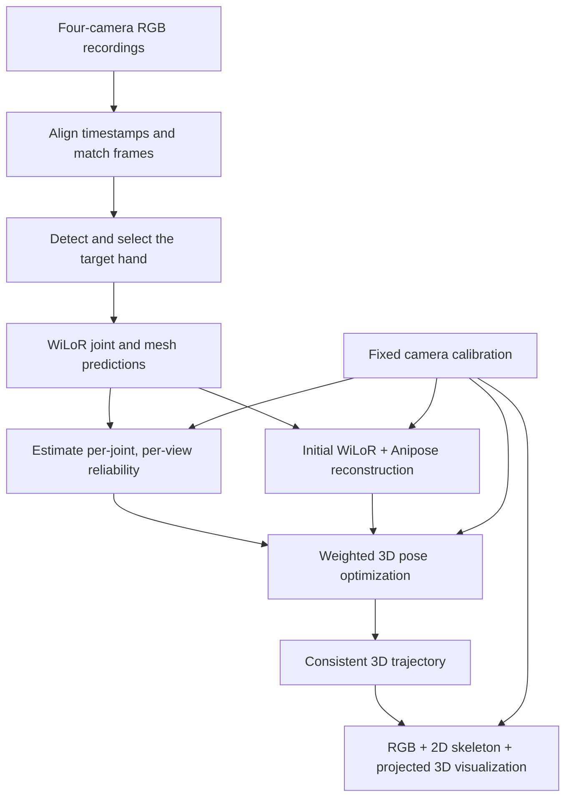
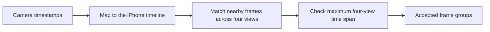
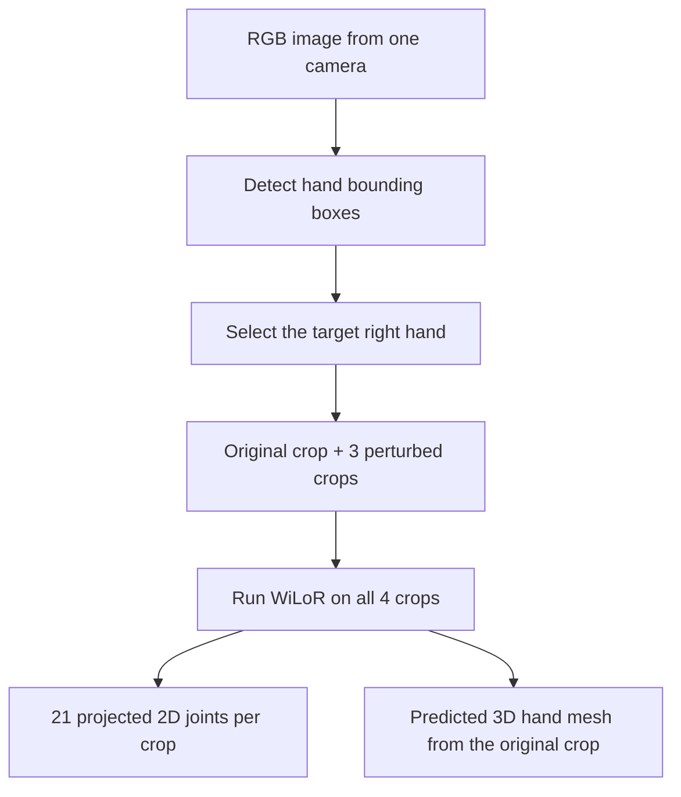
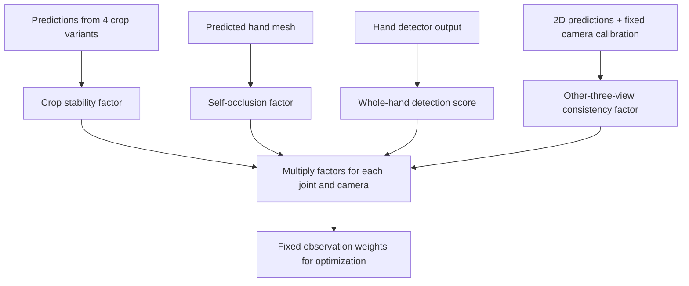
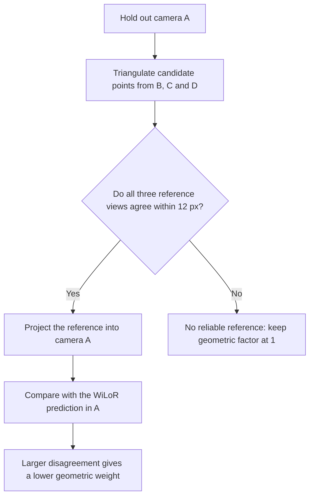
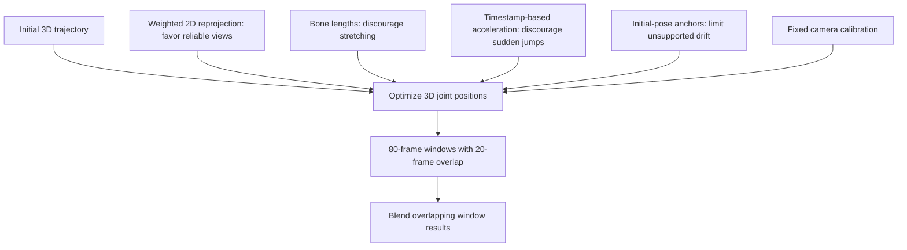
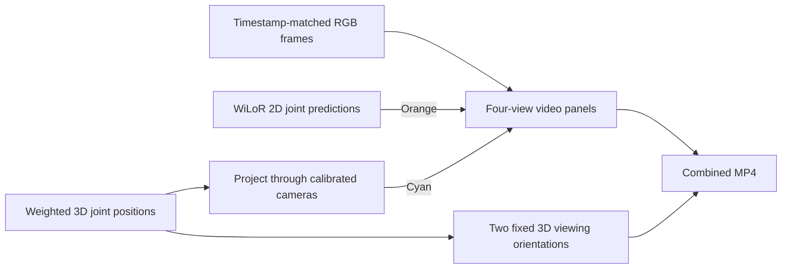

# Multi-Camera Hand Pose Reconstruction

This document describes the implemented WiLoR + Anipose pipeline, including hand bounding-box detection, per-joint reliability weighting, and improvements to 3D consistency.

**Terminology:** “Block detection” refers to **hand bounding-box detection**. The weighted stage refines the **3D pose**, not the camera calibration. Camera intrinsics, distortion, and extrinsics remain fixed during pose optimization.

## 1. Pipeline Overview



**Inputs:** RGB videos, per-frame timestamps, camera calibration, and the configured target hand.

**Outputs:** Timestamped 3D joint positions in calibration-world coordinates, reliability weights, view-support indicators, and visualization videos.

## 2. Timestamp Alignment and Frame Matching

Camera timestamps are mapped onto a shared iPhone time axis. The system uses cam01 as the reference and selects nearby, unused frames from the other cameras.



The allowed time span is controlled by `maxPairSkewMs`. The later approximately 93-second sequence uses **35 ms**; the earlier approximately 103-second sequence uses **30 ms**.

The cameras expose independently. Matching timestamps does not make exposures simultaneous, so fast motion can still create disagreement between views.

## 3. Hand Bounding-Box Detection and WiLoR Inference

Each view is processed independently to detect hand bounding boxes and select the configured right hand.

During the reliability pass, target selection uses a geometric guide from the other views when available. It falls back to the original selected skeleton, or the largest candidate if no guide is available. This reduces some identity errors but does not guarantee that the correct person is selected.



WiLoR can predict a complete hand even when individual fingers are hidden. Therefore, an output joint is not proof that the joint is visible in the image.

## 4. Per-Joint, Per-View Reliability

Each joint receives a separate weight in each camera. Four factors are combined:

```text
Final weight = crop stability
             × mesh visibility factor
             × hand detection score
             × cross-view consistency factor
```

These weights are **heuristic reliability estimates**, not calibrated confidence probabilities.



### 4.1 Crop Stability

The original crop and three slightly shifted or resized crops are passed through WiLoR. Predictions are compared in the original image coordinates.

- Large changes in a joint position reduce its stability weight.
- Similar predictions retain a higher stability weight.

A prediction can be consistently wrong, so stability alone does not establish accuracy.

### 4.2 Mesh Self-Occlusion

For each joint, 16 nearby skin vertices are selected on the MANO rest mesh. Their vertex IDs remain fixed across frames.

For the predicted posed mesh, the algorithm checks whether each sampled vertex is behind another hand surface along the viewing direction. A point is considered visible when its depth is no more than **1 mm** behind the nearest predicted surface.

```text
v = number of visible skin samples / 16
mesh factor = 0.35 + 0.65 × clip(v / 0.45, 0, 1)
```

This is a soft penalty: even zero visible samples produce a mesh factor of 0.35. The predicted mesh may be incorrect, and this check does not model external occluders such as objects or another hand.

### 4.3 Hand Detection Score

The detector provides one confidence score for the whole hand. The current weighting code clips this score to the range **0.3–1.0** before combining it with the other factors.

This score does not directly measure the visibility or accuracy of an individual fingertip.

### 4.4 Cross-View Geometric Consistency

When checking one camera, the system builds a reference using only the other three cameras.



For a valid reference, the geometric factor is:

```text
geometry factor = max(0.02, 1 / (1 + (error_pixels / 15)²))
```

A neutral factor of 1 when the reference is unavailable means **insufficient evidence to penalize the observation**, not confirmed accuracy. Weights remain fixed during the subsequent optimization; fitted residuals are not fed back into a weight-update loop.

## 5. Initial Reconstruction and Weighted 3D Optimization

### 5.1 Initial WiLoR + Anipose Reconstruction

Anipose triangulates corresponding WiLoR 2D joints using the fixed camera calibration. Initial acceptance requires at least two selected cameras and a selected-subset reprojection error of at most **5 px**.

This criterion does not guarantee agreement with every camera. The weighted stage starts from the existing baseline 3D result, including its bone-length and temporal regularization.

### 5.2 Joint Optimization Objectives



| Objective | Implementation | Purpose |
|---|---|---|
| Weighted reprojection | Project 3D joints into each camera; scale pixel residuals by the square root of the observation weight; use a Cauchy loss | Reduce the influence of unreliable observations and large outliers |
| Bone lengths | Penalize deviations from lengths estimated from this recording | Limit implausible changes in finger length |
| Temporal continuity | Penalize acceleration using actual, potentially unequal timestamp intervals | Reduce abrupt trajectory changes |
| Initial-pose anchors | Use a soft-L1 penalty around the baseline 3D positions; stronger anchors when fewer than two view weights pass the support threshold | Reduce depth drift when observations are weak |

Temporal constraints connect nearby valid observations, with a maximum adjacent interval of **0.12 seconds**. Missing samples themselves remain missing.

The optimization updates joint XYZ coordinates. It does not update camera calibration or directly optimize MANO pose parameters. Watch IMU measurements are not used in this pose-fitting objective.

## 6. Handling Occlusion and Reporting Support

If a fingertip is hidden in camera A but visible in B, C and D, the system can lower the weight of A and rely more heavily on the other views. Bone-length, temporal, and initial-pose constraints stabilize the result when the visual evidence is weak.

After optimization, a view counts as supporting a joint when both conditions hold:

- Its weight is at least **0.15**.
- Its reprojection error is at most **15 px**.

| Final support | Interpretation |
|---|---|
| At least two views | The joint has multiview support, but accuracy still depends on geometry, calibration, timing and correct predictions |
| One or zero views | The result relies more heavily on the baseline and structural or temporal constraints |
| Missing in the baseline | The joint remains missing; this stage does not fill it |

## 7. Visualization

The presentation video displays four RGB views with skeleton overlays, alongside two fixed views of the same reconstructed 3D pose.



The clean presentation video uses only the legend **Orange: WiLoR | Cyan: projected 3D**. It omits diagnostic labels and support colors. The diagnostic viewer retains weights and highlights joints with insufficient support.

Skeleton overlays are drawn over the RGB image without hiding joints behind real objects. A projected joint can therefore appear on top of an occluding finger or object.

## 8. Limitations and Interpretation

- Reliability weights can miss stable but incorrect predictions.
- Predicted mesh visibility is not a direct measurement of real visibility.
- Cross-view checking becomes less informative when the other views disagree.
- Better reprojection consistency does not prove better ground-truth 3D accuracy.
- Temporal smoothing can suppress real rapid motion.
- Software timestamp alignment does not eliminate exposure timing differences.

## 9. Implementation Reference

| Component | Source |
|---|---|
| Timestamp alignment and frame matching | [align_multicamera.py](../pc_receiver/align_multicamera.py) |
| Initial WiLoR inference and Anipose triangulation | [process_multicamera.py](../pc_receiver/process_multicamera.py) |
| Crop perturbations, target selection and mesh caching | [infer_hand_reliability.py](../pc_receiver/infer_hand_reliability.py) |
| Stability, self-occlusion and cross-view reliability | [hand_reliability.py](../pc_receiver/hand_reliability.py) |
| Bone-length and timestamp-based motion constraints | [regularize_handpose.py](../pc_receiver/regularize_handpose.py) |
| Weighted 3D optimization | [fit_weighted_handpose.py](../pc_receiver/fit_weighted_handpose.py) |
| Interactive visualization and camera overlays | [visualize_multicamera.py](../pc_receiver/visualize_multicamera.py) |
| Combined and clean presentation videos | [export_pose_presentation.py](../pc_receiver/export_pose_presentation.py) |
